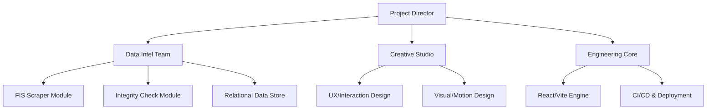

# 00_CORE.md
**Team Korea Winter Dashboard 2025-26 (V3)**
**Core Architecture & Vision / V3**

---

## 1. Project Vision
**"Beyond Data - The Hero's Journey"**

This project is not merely a data dashboard; it is a digital monument to the 43 national team athletes preparing for the 2026 Milano-Cortina Winter Olympics. 

We reject standard, flat informational displays. Instead, we aim to provide a **visceral, cinematic experience** that conveys the intensity, precision, and dynamism of winter sports. The site must feel like a premium editorial piece—sharp, sophisticated, and deeply respectful of the athletes' efforts.

**Core Philosophy:**
-   **Precision**: Data must be 100% accurate. A single error disrespects the athlete.
-   **Depth**: Move beyond simple rankings. Show volatility, consistency, and trajectory.
-   **Aesthetic**: "Noir Luxury". Deep, immersive backgrounds with sharp metallic accents. No cartoons, no emojis, no vibrant primary colors.

---

## 2. Project Scope

### Target Disciplines (7)
1.  **Alpine Skiing** 
2.  **Cross country**
3.  **Freesski - Moguls**
4.  **Freesski - HP,SS,BA**
5.  **Snowboard - HP,SS,BA**
6.  **Snowboard Cross**
7.  **Snowboard Alpine**

### Key Features (V3)
1.  **Immersive Dashboard**: 3D-accelerated data visualization using WebGL/Three.js concepts (simulated via high-end CSS/Framer).
2.  **Relational Data Engine**: A robust backend (or structured JSON) linking Athletes, Events, and Results reliably.
3.  **Editorial Profiles**: Athlete pages that function like high-end magazine features, not spreadsheet dumps.
4.  **Live Intelligence**: Real-time countdowns and automated status updates based on the competition calendar.

---

## 3. System Architecture

### V3 Agent Organization
The system operates under a strict hierarchy of specialized agents (or modules), directed by a central logic core.



---

## 4. Design Identity: "Noir Luxury"

**Rejection of the "Standard Tech" Aesthetic**
-   **NO** Flat Blue/Red Primary Buttons.
-   **NO** Standard rounded Bootstrap/Tailwind cards.
-   **NO** Emojis in UI or Documentation.
-   **NO** "Playful" or "Cute" elements.

**The V3 Standard**
-   **Palette**: Deep Navy (#0B101A), Metallic Silver (#E2E8F0), Ember Red (#E53E3E - Minimal Accent).
-   **Typography**: Tall, condensed headers (Teko/Oswald) for impact. Clean sans-serif (Pretendard) for readability.
-   **Texture**: Subtle grain, mesh gradients, glass-over-metal effects.
-   **Motion**: Heavy, physical transitions. Magnetic cursors. Parallax scrolling.

---

## 5. Technology Stack (V3)

### Frontend Core
-   **Framework**: React 18+ (TypeScript Strict Mode)
-   **Build System**: Vite
-   **Animation**: Framer Motion (Complex orchestration)
-   **3D/Canvas**: React Three Fiber (for background atmosphere, optional but planned)
-   **Styling**: Tailwind CSS (with highly customized `tailwind.config.js`)

### Data Layer
-   **Source**: FIS Official Website
-   **Processing**: Python 3.11+ (Type Hinted)
-   **Storage**: Structured JSON (Relational Schema: `athletes.json`, `events.json`, `results.json`)
-   **Validation**: Pydantic models for strict data integrity.

---

## 6. Project Structure

```text
team-korea-winter-2025-26/
├── 00_CORE.md              # Project Vision & Arch
├── 10_PM.md                # Management & Standards
├── 20_DATA_TEAM.md         # Data Schema & Pipeline
├── 30_DESIGN_TEAM.md       # Design System & Motion
├── 40_DEV_TEAM.md          # Technical Implementation
├── src/                    # Application Source
│   ├── assets/             # High-res textures/icons
│   ├── core/               # System logic
│   ├── features/           # Domain features (Dashboard, Athlete, etc.)
│   └── shared/             # Reusable UI components
└── data/                   # The Source of Truth
```

---

## 7. Success Metircs
1.  **Zero Data Errors**: Automated validation scripts must return 0 defects.
2.  **Premium Feel**: User feedback must describe the site as "Professional", "Cool", or "High-End".
3.  **Performance**: 60fps animations on standard laptops.

---

**Project Lead**: Team Korea Digital Unit
**Version**: 3.0.0 (The Leap)
**Date**: 2026-01-27
